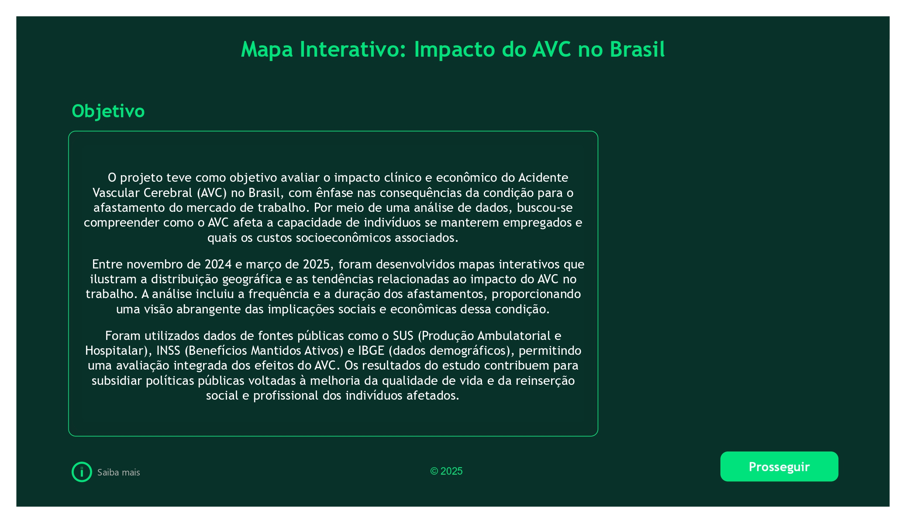
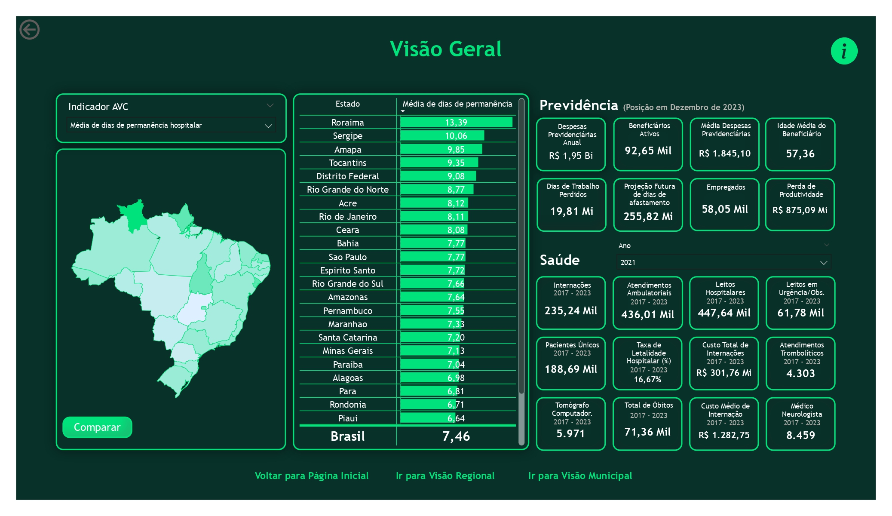
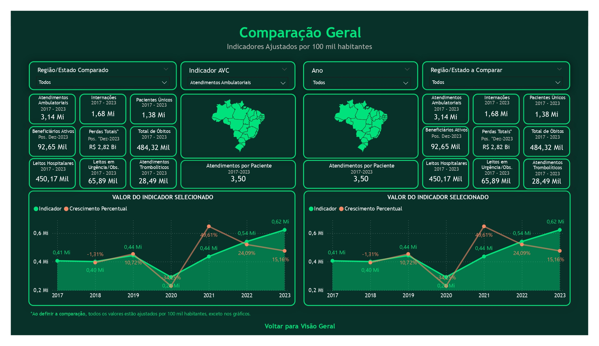
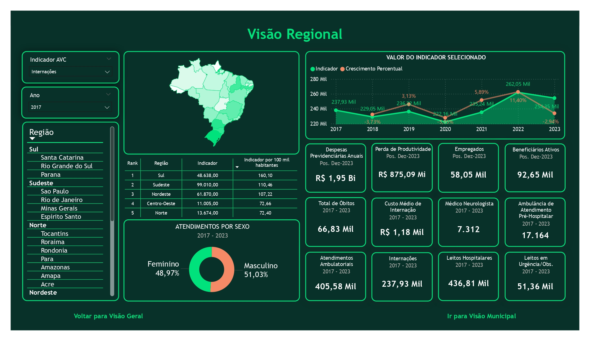
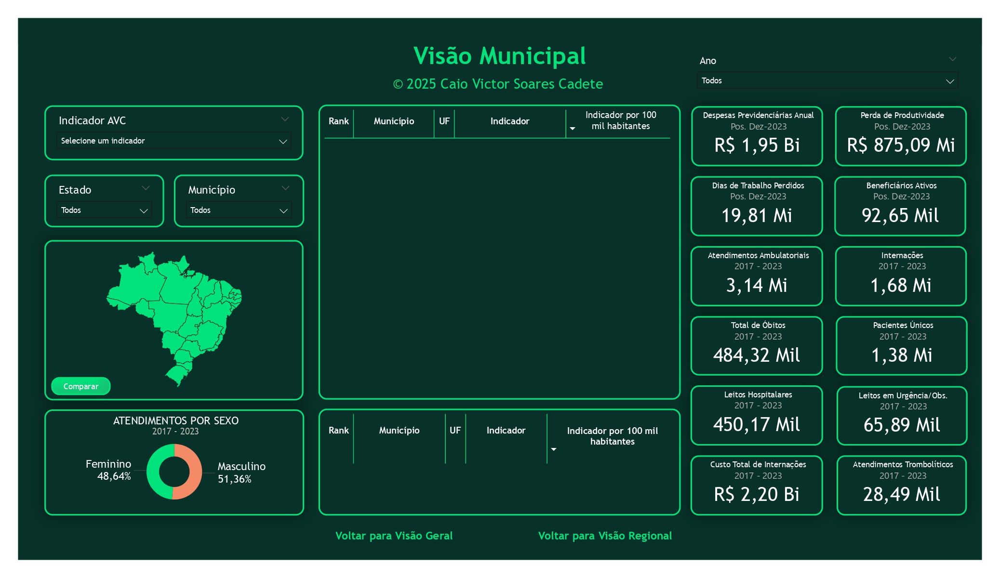
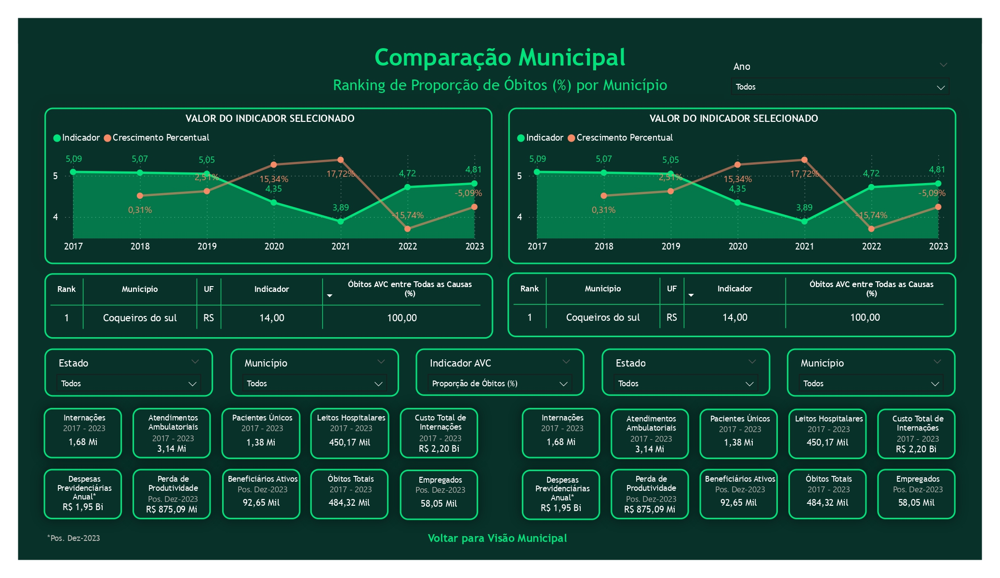
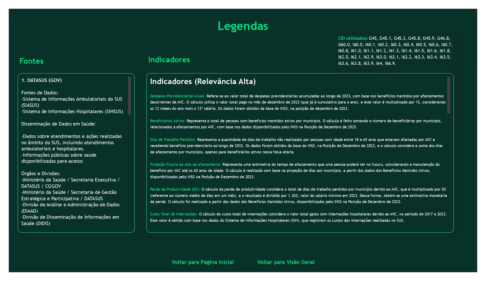

# 🧠 Dashboard Interativo: Impacto do AVC no Brasil

Este projeto apresenta um dashboard desenvolvido no Power BI para análise do impacto do Acidente Vascular Cerebral (AVC) no Brasil, utilizando dados públicos de saúde. O objetivo é promover uma visualização interativa e estratégica dos principais indicadores relacionados à ocorrência, tratamento e mortalidade por AVC em diferentes regiões do país.

---

## 🎯 Objetivo

- Analisar a distribuição geográfica de internações por AVC
- Avaliar os custos hospitalares e tempo médio de permanência
- Medir taxas de mortalidade e óbitos hospitalares por município
- Relacionar indicadores com infraestrutura de saúde (leitos, médicos, tomógrafos)
- Combinar dados do SUS, INSS e IBGE para fornecer uma visão integrada

---

## 📊 Principais Indicadores

- Internações por AVC por região e estado
- Custo total e médio por internação
- Dias de internação e permanência média
- Óbitos hospitalares e taxa de mortalidade
- Quantidade de tomógrafos, médicos e leitos por região
- Benefícios ativos relacionados ao AVC (INSS)
- Perfil populacional e demográfico das regiões (IBGE)

---

## 📸 Visualizações do Dashboard

Abaixo, algumas das visualizações extraídas do dashboard interativo sobre o impacto do AVC no Brasil:

### 🎯 Tela 1 – Objetivo do Estudo

### 🧭 Tela 2 – Visão Geral dos Dados

### 🔍 Tela 3 – Comparativo Nacional e Regional

### 🌎 Tela 4 – Visão Regional (por Grandes Regiões)

### 🗺️ Tela 5 – Visão Municipal Interativa

### 📍 Tela 6 – Comparação Detalhada entre Municípios

### 🧾 Tela 7 – Legenda e Interpretação dos Dados

---

## 📁 Fontes de Dados

Todos os dados utilizados são públicos e foram obtidos dos seguintes sistemas:

- **DATASUS / TABNET / Ministério da Saúde**
  - SIH/SUS (Sistema de Informações Hospitalares)
  - SIA/SUS (Sistema de Informações Ambulatoriais)
  - SIM (Sistema de Informações sobre Mortalidade)
  - CNES (Cadastro Nacional de Estabelecimentos de Saúde)

- **INSS**
  - Sistema Único de Informações de Benefícios (SUIBE)

- **IBGE**
  - Censo 2022
  - Sistema de Contas Nacionais (PIB por região)

Os dados foram acessados via FTP e portais de dados abertos do Governo Federal.

---

## 🛠️ Ferramentas Utilizadas

- Power BI (desenvolvimento do dashboard)
- Python (mineração, limpeza e transformação de dados)
- FTP/DATASUS
- Excel (pré-processamento)

---

## ⚠️ Observação

Este projeto foi desenvolvido para fins educacionais e de portfólio, com dados públicos e sem vínculo com empresas ou instituições privadas. Nenhuma informação sensível ou confidencial foi utilizada.

---

## 👨‍💻 Autor

Caio Victor Soares Cadete  
[GitHub: caio-cadete](https://github.com/caio-cadete)
